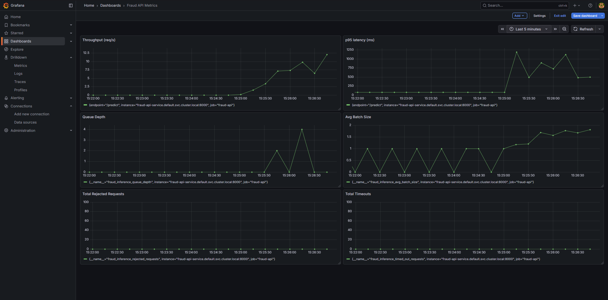
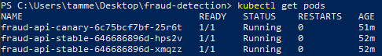
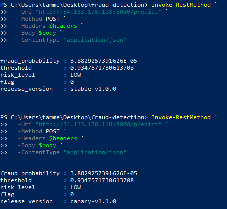
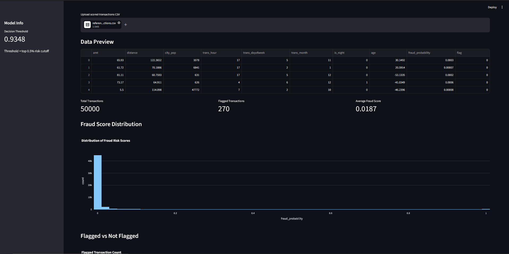
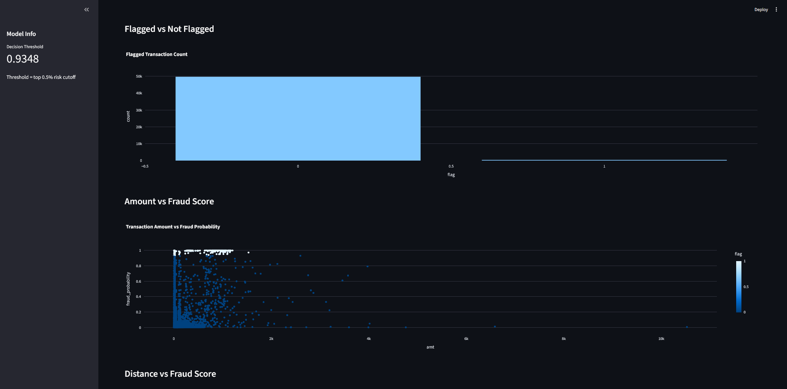
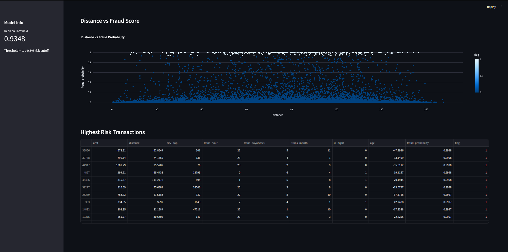

# Fraud Detection MLOps System


Production-grade fraud detection MLOps platform built on 1M+ credit card transactions, deployed on Google Kubernetes Engine.

The platform emphasizes **inference systems engineering** over model training, focusing on throughput, latency, operational reliability, and deployment automation. A custom asynchronous dynamic batching runtime serves an XGBoost fraud classifier via FastAPI, sustaining **255 req/s with 0% failed requests** under 100 concurrent users in Kubernetes load testing.

## Results at a Glance

| Metric | Value |
|---|---|
| Model PR-AUC | ~0.86 |
| Precision @ top 0.5% | ~0.83 |
| Recall @ top 0.5% | ~0.76 |
| Batched throughput vs direct | +18.9% |
| k6 load test throughput | 255.40 req/s |
| k6 p95 latency | 268.14 ms |
| k6 failure rate | 0.00% |
| Test coverage | 92% |

## Tech Stack

**ML:** XGBoost, SHAP, MLflow, Evidently AI
**Backend:** FastAPI, asyncio, PostgreSQL
**Streaming:** Kafka
**Orchestration:** Airflow, Celery, Redis
**Infrastructure:** Docker, Kubernetes, GKE, Prometheus, Grafana
**Testing & CI:** pytest, k6, GitHub Actions, Bandit, Trivy

## System Architecture

```
Clients
   ↓
Google Cloud Load Balancer
   ↓
Kubernetes Service
   ↓
Stable + Canary FastAPI Deployments (HPA: 2–6 pods)
   ↓
Custom Async Dynamic Batching Engine
   ↓
XGBoost Fraud Model

Prometheus ← /metrics endpoint
Grafana    ← Prometheus

Kafka Producer → Kafka Consumer → Inference API → Scored Transactions
                                        ↓
                                       DLQ (failed events)

Airflow DAG → Evidently Drift Monitor → Conditional Retraining → MLflow → Model Promotion Gate
```


## Inference Engine

Fraud transaction volume is inherently bursty. End-of-day settlement periods and promotional events cause sudden load spikes. The custom async batching runtime handles this by grouping concurrent requests into single model inference calls, reducing per-request overhead without sacrificing latency guarantees.

**Two inference modes:**

Direct inference — single request, immediate prediction:
```
client request → FastAPI → model.predict_proba(single) → response
```

Dynamic batched inference — requests grouped within a timeout window:
```
client request → async queue → dynamic batcher → model.predict_proba(batch) → futures resolved
```

**Runtime stability features:**

- Bounded async queue with configurable max size — prevents unbounded memory growth under overload
- HTTP 503 rejection when queue is full — explicit backpressure rather than silent degradation
- HTTP 504 on request timeout — bounded latency guarantees under sustained load
- Future cancellation safety — no orphaned futures on client disconnect
- Runtime metrics endpoint at `/metrics`

### Benchmarking Results

Benchmarks run with 10,000 requests, 50 concurrent clients, 100 warmup requests, 2 Uvicorn workers, `BATCH_TIMEOUT_MS=3`, `MAX_BATCH_SIZE=128`, `MAX_QUEUE_SIZE=500`.

| Endpoint | Throughput | p50 | p95 | p99 |
|---|---:|---:|---:|---:|
| /predict_direct | 157.45 req/s | 209.43 ms | 320.59 ms | 342.25 ms |
| /predict (batched) | 187.19 req/s | 208.83 ms | 296.49 ms | 352.47 ms |

Dynamic batching achieved **+18.9% throughput** and **-7.5% p95 latency**. Median latency remained nearly identical, confirming that batching overhead does not affect typical requests. The slight p99 increase reflects the expected throughput vs tail latency tradeoff inherent to queue-based batching — requests arriving just after a batch dispatches wait for the next timeout window.

### Runtime Metrics Endpoint

```json
{
  "queue_depth": 0,
  "total_requests": 10000,
  "total_batches": 228,
  "avg_batch_size": 43.8,
  "max_batch_size": 64,
  "batch_timeout_ms": 10
}
```

## Production Infrastructure

### Google Kubernetes Engine (GKE)

The inference API is deployed to GKE with production-style operational controls:

- **Horizontal Pod Autoscaler** — CPU-based scaling, 2–6 replicas
- **Canary deployment** — stable and canary deployments behind a shared Service and LoadBalancer
- **Rolling updates** — zero-downtime deployments
- **Readiness, liveness, and startup probes** — traffic only routes to healthy pods
- **PodDisruptionBudget** — availability guarantees during rollouts
- **Resource requests and limits** — prevents noisy-neighbour resource contention
- **Kubernetes Secrets** — credentials injected at runtime, never hardcoded
- **Prometheus scraping** — metrics collected from all pods automatically

### Grafana Dashboard

The dashboards visualize real-time inference telemetry exported from the batching runtime and scraped by Prometheus across Kubernetes pods.



Live metrics tracked:
- Request throughput
- p50/p95/p99 latency
- Dynamic batch size distribution
- Queue depth
- Rejected requests (503)
- Timed-out requests (504)

### Kubernetes Pods



### HPA Autoscaling

During k6 load testing, CPU utilization exceeded the 60% target and Kubernetes scaled from 2 to 6 replicas automatically.

| Metric | Value |
|---|---:|
| Min replicas | 2 |
| Max replicas | 6 |
| CPU target | 60% |
| Observed scale-up | 2 → 6 pods |

### k6 Kubernetes Load Test

Load tested against the GKE-deployed API with staged traffic ramp-up to 100 virtual users.

| Metric | Result |
|---|---:|
| Max virtual users | 100 |
| Total requests | 30,654 |
| Throughput | 255.40 req/s |
| Average latency | 119.33 ms |
| Median latency (p50) | 103.89 ms |
| p90 latency | 227.21 ms |
| p95 latency | 268.14 ms |
| Max latency | 556.26 ms |
| Failed requests | 0 |
| Failure rate | 0.00% |
| Checks passed | 100% |

### Canary Deployment

Traffic is split between stable and canary deployments via replica ratio through a shared Kubernetes Service. The canary release validates changes to batching configuration, inference logic, or performance tuning before full rollout. Canary pods expose `release_version` in API responses for validation during testing.

```json
{
  "release_version": "canary-v1.1.0"
}
```

### Canary Validation

Requests routed through the shared Kubernetes Service return different release versions depending on stable/canary pod routing.



## MLOps Pipeline

### Drift Monitoring and Retraining

Airflow orchestrates the `fraud_monitoring_and_retraining` DAG on a schedule:

1. Run Evidently drift monitoring against recent prediction logs
2. Check drift status across features and prediction distribution
3. Trigger retraining if drift exceeds threshold
4. Log candidate model metrics to MLflow
5. Promote new model only if it improves over current production metrics

Airflow runs with **CeleryExecutor** backed by PostgreSQL (metadata store) and Redis (task broker) which is production-style distributed orchestration rather than the default SequentialExecutor.

### MLflow Experiment Tracking

All training runs log:
- Hyperparameters
- PR-AUC, precision, recall at threshold
- Model artifacts
- Feature importance

The promotion gate compares candidate model PR-AUC against the registered production model before any promotion occurs.

### Evidently AI

- Data drift detection across all input features
- Prediction drift tracking
- Feature distribution monitoring with drift reports


## Kafka Streaming Pipeline

Transaction events are produced to a Kafka topic, consumed by the inference service for real-time scoring, and published to a scored transactions topic. A dead letter queue (DLQ) captures failed events for inspection and replay — critical in fraud detection where dropping transactions has real consequences.

```
producer.py → kafka topic → consumer → inference API → scored topic
                                   ↓
                                  DLQ (failed events)
```

To run the simulated stream:
```bash
python streaming/producer.py
```


## API

### Request

```json
{
  "amt": 5000,
  "lat": 40.7128,
  "long": -74.0060,
  "merch_lat": 34.0522,
  "merch_long": -118.2437,
  "city_pop": 1000,
  "category": "shopping_net",
  "gender": "M",
  "state": "CA",
  "merchant": "unknown_store",
  "trans_date_trans_time": "2020-12-25 02:30:00",
  "dob": "2003-01-01"
}
```

### Response

```json
{
  "fraud_probability": 0.93,
  "threshold": 0.92,
  "risk_level": "HIGH",
  "flag": 1,
  "release_version": "stable-v1.0.0",
  "top_reasons": [
    {"feature": "distance", "impact": 0.8},
    {"feature": "amt_log", "impact": 0.6}
  ]
}
```

SHAP values are computed per request and returned as `top_reasons`, giving each prediction an auditable explanation — a regulatory requirement in production fraud systems.


## Streamlit Dashboard





Live views:
- Fraud score distribution
- Flagged transactions
- Risk by merchant category
- High-risk transaction feed

## CI/CD

GitHub Actions pipeline runs on every push and pull request to `main`:

- Lint with Ruff
- Unit and integration tests with pytest
- Coverage enforcement (minimum 70%, currently 92%)
- FastAPI import validation
- Docker image build
- Docker container smoke test (live `/docs` check)
- Security scan with Bandit
- Docker image vulnerability scan with Trivy

## Project Structure

```
fraud-detection-mlops/
│
├── app/                  # FastAPI inference service and dynamic batching engine
├── src/                  # Model training, preprocessing, feature engineering
├── dashboard/            # Streamlit monitoring dashboard
├── dags/                 # Airflow DAGs and orchestration pipelines
├── monitoring/           # Drift detection and retraining logic
├── streaming/            # Kafka transaction stream simulation
├── benchmarks/           # Load testing and inference benchmarking
├── tests/                # Unit and integration tests (92% coverage)
├── load_tests/           # k6 load tests
├── k8s/                  # Kubernetes manifests, HPA, canary configs
├── data/                 # Raw and processed datasets
├── models/               # Trained model artifacts
│
├── Dockerfile
├── docker-compose.yml
├── requirements.txt
├── requirements-airflow.txt
├── requirements-dev.txt
└── README.md
```

## Running Locally

```bash
git clone https://github.com/ReymoT/fraud-detection-mlops.git
cd fraud-detection-mlops
cp .env.example .env  # configure environment variables
docker compose up --build
```

| Service | URL |
|---|---|
| Inference API | http://localhost:8000/docs |
| Streamlit Dashboard | http://localhost:8501 |
| Airflow | http://localhost:8080 |

Sensitive configuration (API keys, database credentials) is injected via environment variables. See `.env.example` for required values.

## What I'd Add in Production

- **Managed Kafka** (Confluent Cloud or AWS MSK) — eliminates broker operational overhead
- **Managed Airflow** (MWAA, Astronomer, or Cloud Composer) — removes CeleryExecutor self-management
- **Cloud object storage** (GCS or S3) — centralized artifact storage for MLflow, models, and drift reports
- **Container registry** (GCR, ECR, or GHCR) — versioned image management
- **KubernetesExecutor for Airflow** — per-task pod scaling instead of fixed Celery workers
- **Triton Inference Server** — multi-model serving with GPU optimization
- **Distributed tracing** (Jaeger or OpenTelemetry) — request tracing across Kafka, inference, and retraining services

## Lessons Learned

- Dynamic batching improves throughput meaningfully but the p99 tradeoff is real and measurable. The batch timeout window is the key tuning parameter — too short and you lose batching efficiency, too long and tail latency grows. The 3ms timeout was chosen empirically from benchmarking across the curve.
- Backpressure needs an explicit design decision, not an afterthought. The bounded queue with 503 rejection was a deliberate choice — shedding load is preferable to unbounded queue growth that degrades latency for all requests.
- Canary deployment via replica ratio is operationally simple but coarse — a 1:4 canary:stable ratio gives roughly 20% traffic split. Service mesh (Istio) would allow precise percentage-based routing without replica math.
- The simulated Kafka stream simplifies real-world complexity. A live stream introduces out-of-order events, consumer lag under backpressure, and partition rebalancing — none of which the simulation exercises.
